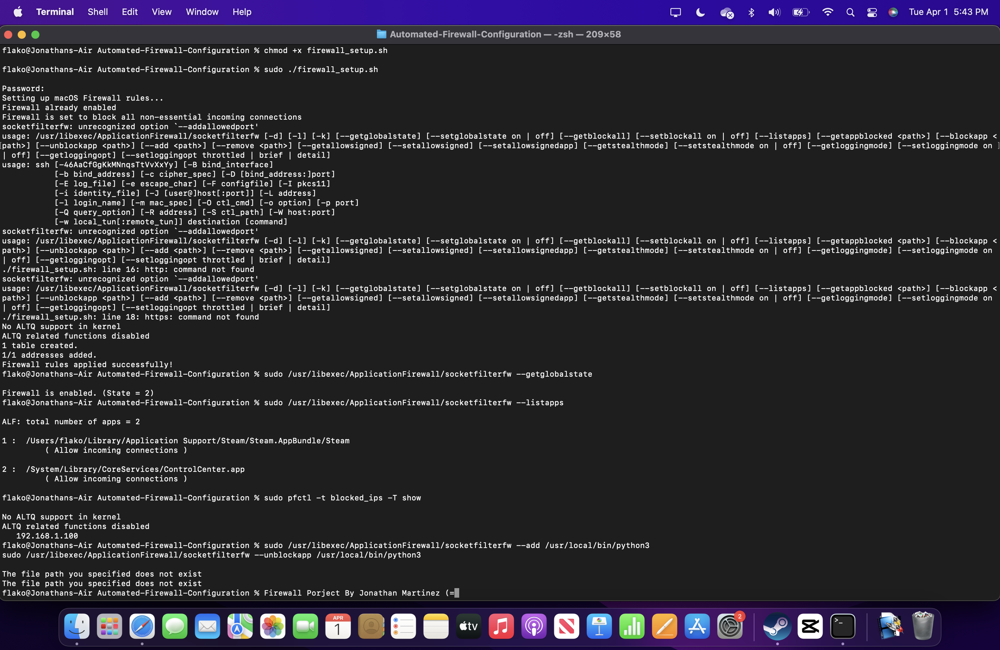

## **3️⃣ Automated Firewall Configuration (Bash/Python) 🔥**

### **Description**
A script that automates firewall rules to enhance network security by blocking suspicious IPs and enforcing security policies.

## ScreenShot



### **Tech Stack**
- Python
- Bash
- iptables

### **Installation & Usage**
```bash
# Clone the repository
git clone https://github.com/yourgithub/Firewall-Config.git
cd Firewall-Config

# Run the script
bash firewall_setup.sh
```
